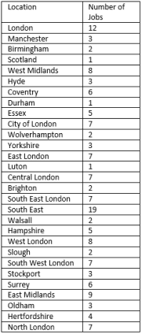

## Sam Crockett

Im a student at the University of the West of England studying Games Technology.

## What is a Gameplay Programmer?
### Places Hiring

https://uk.linkedin.com/jobs/view/game-programmer-at-marmalade-game-studio-2408913395?refId=726508c7-bf4e-4e8d-bc36-b0bf4d222ba8&trackingId=PQLTzK5DafMkKNBDvTKnRw%3D%3D&position=2&pageNum=0&trk=public_jobs_job-result-card_result-card_full-click
https://uk.linkedin.com/jobs/view/game-programmer-at-opmjobs-2416021740?refId=726508c7-bf4e-4e8d-bc36-b0bf4d222ba8&trackingId=mZCdYK7KBxGujwMzybMHMg%3D%3D&position=5&pageNum=0&trk=public_jobs_job-result-card_result-card_full-click
https://www.totaljobs.com/job/c-programmer/exposed-solutions-job91961299
https://www.totaljobs.com/job/c-programmer/exposed-solutions-job91961313
https://www.totaljobs.com/job/c-software-developer/csr-development-job91982721
https://uk.indeed.com/jobs?q=Gameplay%20Programmer&vjk=4d07ad95be86c185
https://uk.indeed.com/jobs?q=Gameplay%20Programmer&vjk=5624b0bee22eaf07

### Job Description

Researching the role, I discovered what is required to be a Gameplay Programmer. A gameplay programmer 
must be able to communicate. At the start of every games development a gameplay programmer needs to 
work with writers and designers to determine how the game should play to produce the best possible 
result. Following on from this a Gameplay Programmer needs knowledge of gameplay and game engines, the
ability to determine the best mechanics and gameplay required for each given experience in a game and 
determining which engine to use to implement those mechanics to a high standard using different 
engines abilities.

### Contact

