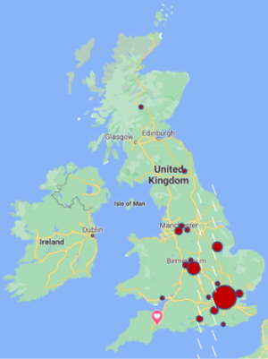

## Sam Crockett

Im a student at the University of the West of England studying Games Technology.

### Markdown

Markdown is a lightweight and easy-to-use syntax for styling your writing. It includes conventions for

```markdown
Syntax highlighted code block

# Header 1
## Header 2
### Header 3

- Bulleted
- List

1. Numbered
2. List

**Bold** and _Italic_ and `Code` text

[https://uk.indeed.com/jobs?q=Gameplay%20Programmer&vjk=5624b0bee22eaf07]() 


```


For more details see [GitHub Flavored Markdown](https://guides.github.com/features/mastering-markdown/).

### Contact


