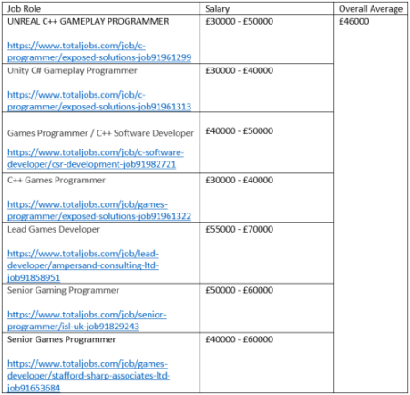

## Sam Crockett

Im a student at the University of the West of England studying Games Technology.

## What is a Gameplay Programmer?

## Job Description

Researching the role, I discovered what is required to be a Gameplay Programmer. A gameplay programmer 
must be able to communicate. At the start of every games development a gameplay programmer needs to 
work with writers and designers to determine how the game should play to produce the best possible 
result. Following on from this a Gameplay Programmer needs knowledge of gameplay and game engines, the
ability to determine the best mechanics and gameplay required for each given experience in a game and 
determining which engine to use to implement those mechanics to a high standard using different 
engines abilities.

## Places Hiring

https://uk.linkedin.com/jobs/view/game-programmer-at-marmalade-game-studio-2408913395?refId=726508c7-bf4e-4e8d-bc36-b0bf4d222ba8&trackingId=PQLTzK5DafMkKNBDvTKnRw%3D%3D&position=2&pageNum=0&trk=public_jobs_job-result-card_result-card_full-click

https://uk.linkedin.com/jobs/view/game-programmer-at-opmjobs-2416021740?refId=726508c7-bf4e-4e8d-bc36-b0bf4d222ba8&trackingId=mZCdYK7KBxGujwMzybMHMg%3D%3D&position=5&pageNum=0&trk=public_jobs_job-result-card_result-card_full-click

https://www.totaljobs.com/job/c-programmer/exposed-solutions-job91961299

https://www.totaljobs.com/job/c-programmer/exposed-solutions-job91961313

https://www.totaljobs.com/job/c-software-developer/csr-development-job91982721

https://uk.indeed.com/jobs?q=Gameplay%20Programmer&vjk=4d07ad95be86c185

https://uk.indeed.com/jobs?q=Gameplay%20Programmer&vjk=5624b0bee22eaf07

https://www.totaljobs.com/jobs/gameplay-programmer

## Potential Adjacent or Similar Roles 
Gameplay Programmers are a vital aspect of game development. However there are other roles that are needed to produce a game. 
One example are engine developers, this role focuses on creating new functionality to the engines used to create the game and
improving on previous systems to make the engines more efficient. You also have AI programmers who focus on creating and 
implementing artifical intelligence in games. another example could be network programmers who specialise in online connectivity 
and creating multiplayer systems. While Gameplay programmers are do play a major role in the creation of a game there are many 
other roles that play a very significant part.

## Advice for other aspiring Gameplay Programmers

As mentioned at the start, one of the most important things that a Gameplay Programmer must be able to do is communicate. But you 
shouldnt restrict this skill to just game development. One of the best things that you can do as an aspiring Gameplay Programmer 
is get involved with other programmers and the community. The more people you meet and the more people that you can talk to about 
any struggles that you have starting off the easier you will find you experience.

## Contact

Email: Samuel2.Crockett@live.uwe.ac.uk

Github: https://github.com/S2-Crockett

